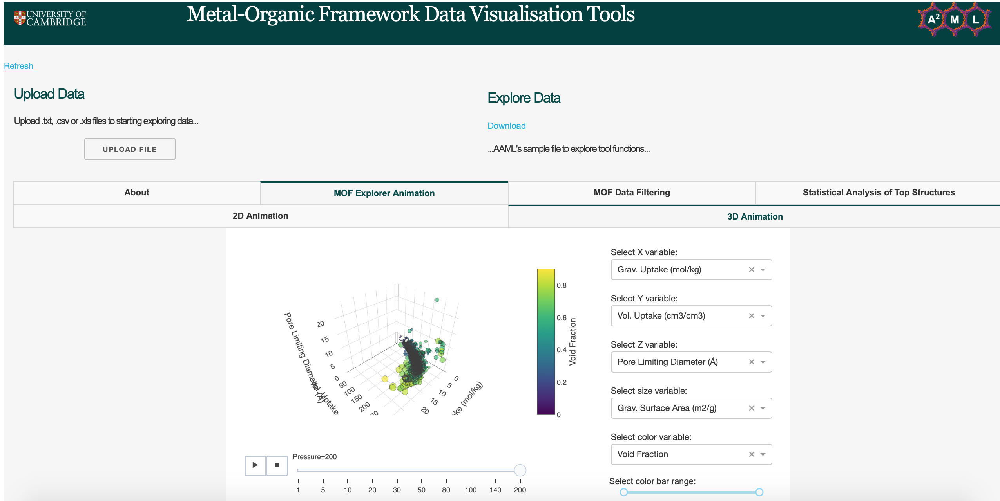

# Metal-organic Framework Visualisation Tools

## About
These tools aim to provide a reproducible and consistent data visualisation platform where experimental and computational researchers can use big data and statistical analysis to explore their data or the adsorption related data we provide to find the best materials for specific applications.

### App Manual
- The app manual, explaining data file upload requirements and features of the tool can be found [here](https://aaml-analytics.github.io/mof-explorer/)

## Deploying to Heroku
```bash
heroku create
git push heroku master
heroku open
```
Alternatively, you can deploy your own copy of the app using this button and creating your own Heroku account:
[](https://heroku.com/deploy)

- Note: Once you have created your own copy of the app, after a period of inactivity Heroku shuts down the app's containers. Once the app gets a web request (the link above is used), it will wake up, but the initial response can take 10-20 seconds.

## Deploy app on server by Gunicorn

### Requirements
- Download [Python 3](https://www.python.org) if not already installed 
- Install [Git](https://git-scm.com/downloads) 
-- Installation instructions using command line can be found [here](https://git-scm.com/book/en/v2/Getting-Started-Installing-Git) 
Note: If you are using Git after upgrading to macOS Catalina and get the following error...
```bash
xcrun: error: invalid active developer path (/Library/Developer/CommandLineTools), missing xcrun at: /Library/Developer/CommandLineTools/usr/bin/xcrun
```
...run the following in your terminal:
```bash
xcode-select --install
```
- Install virtualenv to create virtual environments 
```bash
pip install virtualenv
```

### Running the app
To run this app first clone repository and then open a terminal to the app folder.
```bash
git clone https://github.com/aaml-analytics/mof-explorer/
cd mof-explorer
```

Create and activate a new virtual environment (recommended) by running the following:

On Windows:
```bash
virtualenv venv
\venv\scripts\activate
```

Or if using macOS or linux
```bash
python3 -m venv myvenv
source myvenv/bin/activate
```

Install the requirements:

```bash
pip install -r requirements.txt
```

Run the app:
```bash
gunicorn app:server -b :8000
```

You can then run the app on your browser at http://0.0.0.0:8000

## Screenshots



## Contributing
When contributing to this repository, please first discuss the change you wish to make via issue, email, or any other method with the owners of this repository before making a change. You can also contact the AAML research group to discuss further contributions and collaborations. Please read [CONTRIBUTING.md](https://github.com/aaml-analytics/mof-explorer/blob/master/CONTRIBUTING.md) for details on our code of conduct.

## **Contact Us**
**Email**: 
[Mythili Sutharson](mailto:mls67@cam.ac.uk),
[Nakul Rampal](mailto:nr472@cam.ac.uk),
[Rocio Bueno Perez](mailto:rb901@cam.ac.uk),
[David Fairen Jimenez](mailto:df334@cam.ac.uk) <br>
**Website:** http://aam.ceb.cam.ac.uk/ <br>
**Address:** <br>
Department of Chemical Engineering and Biotechnology <br>
Cambridge University <br>
Philippa Fawcett Dr<br>
Cambridge <br>
CB3 0AS

## License
This project is licensed under the MIT License - see the [LICENSE.md](https://github.com/aaml-analytics/mof-explorer/blob/add-license-1/LICENSE) file for details

## Acknowledgments
<p> 
  
</p>

- [AAML Research Group](http://aam.ceb.cam.ac.uk) for developing this dashboard for the MOF community. Click [here](http://aam.ceb.cam.ac.uk/research.html) to read more about our work
- [Dash](https://plot.ly/dash/) - the python framework used to build this web application
