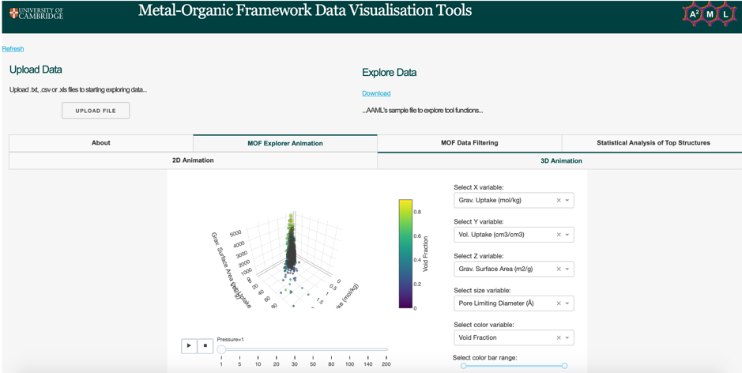

# Metal-organic Framework Visualisation Tools
Content from AAML Data Analytics Tool

## About this app
These tools aim to provide a reproducible and consistent data visualisation platform where experimental and computational researchers can use big data and statistical analysis to find the best materials for specific applications.

## Running app on browser
ADD_LINK

## How to run this app

### Requirements
- Download [Python 3](https://www.python.org) if not already installed 
- Install [Git](https://git-scm.com/downloads) 
-- Installation instructions using command line can be found [here](https://git-scm.com/book/en/v2/Getting-Started-Installing-Git) 

To run this app first clone repository and then open a terminal to the app folder.
```bash
git clone https://github.com/aaml-analytics/mof-explorer/
cd mof-explorer
```

Create and activate a new virtual environment (recommended) by running
the following:

On Windows:
```bash
virtualenv vena
\venv\scripts\activate
```

Or if using macOS or linux
```bash
python3 -m venv myvenv
source myvenv/bin/activate
```

Install the requirements:

```bash
pip install -r requirements.txt
```
Run the app:

```bash
export FLASK_APP=app-HTTP.py
export FLASK_ENV=development
flask run
```

You can then run the app on your browser at http://127.0.0.1:5000/

## Screenshots



## Contributing
For changes, please open an issue first to discuss what you would like to change. You can also contact the AAML research group (enter email) to discuss further contributions and collaborations 

### Credit

- [AAML Research Group](http://aam.ceb.cam.ac.uk) for developing this dashboard for the MOF community. Click [here](http://aam.ceb.cam.ac.uk/research.html) to read more about our work.
- [Dash](https://plot.ly/dash/) - the python framework used to build this web application.
